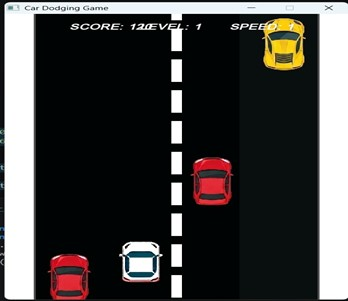
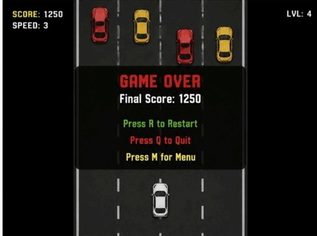

# Car Dodging Game 🏎️

A fast-paced, 2D endless arcade game built in C++ using the Simple and Fast Multimedia Library (SFML). Take control of a white car and weave through heavy oncoming traffic on a 4-lane highway. The longer you survive, the faster and harder the game gets!

## 📸 Screenshots

<div align="center">
  
  
  

</div>

## ✨ Features

* **Endless Gameplay:** The game continues as long as you can avoid collisions.
* **Dynamic Difficulty:** Speed and spawn rates ramp up over time, increasing your level.
* **Multiple Difficulties:** Switch between Easy, Medium, and Hard modes on the fly.
* **Smooth Movement:** Fluid lane-changing and vertical movement mechanics.
* **Score System:** Earn points based on time survived and the number of cars successfully dodged.
* **Audio Integration:** Background music and sound effects for movement and collisions.

## 🎮 Controls

| Key | Action |
| :--- | :--- |
| **W / Up Arrow** | Move Up |
| **S / Down Arrow**| Move Down |
| **A / Left Arrow**| Move Left (Change Lane) |
| **D / Right Arrow**| Move Right (Change Lane) |
| **P** | Pause / Resume |
| **R** | Restart (on Game Over screen) |
| **1 / 2 / 3** | Set Difficulty (Easy / Medium / Hard) & Restart |
| **ESC** | Quit Game |

## 🛠️ Prerequisites

To build and run this project, you will need:
* A C++ compiler that supports **C++17** or higher (e.g., GCC, Clang, MSVC).
* **SFML 2.5+** (Simple and Fast Multimedia Library) installed on your system.
* Standard system fonts (`arial.ttf` or `calibri.ttf` are referenced in the code for Windows compatibility).

## 🚀 Setup & Installation

1. **Clone the repository:**
   ```bash
   git clone [https://github.com/YourUsername/Car-Dodging-Game.git](https://github.com/YourUsername/Car-Dodging-Game.git)
   cd Car-Dodging-Game
   ```

2. **Organize your assets:**
   Ensure all image and audio files are placed inside an `Assets/` directory in the root folder, as the code expects this structure:
   ```text
   📂 Car-Dodging-Game
   ├── 📄 main.cpp
   ├── 📄 README.md
   └── 📂 Assets
       ├── 🖼️ WhiteCar.png
       ├── 🖼️ RedCar1.png
       ├── 🖼️ RedCar2.png
       ├── 🖼️ YellowCar1.png
       ├── 🖼️ YellowCar2.png
       ├── 🖼️ YellowCar3.png
       ├── 🎵 background.ogg
       ├── 🎵 collision.wav
       └── 🎵 move.wav
   ```

3. **Compile the game:**
   Using GCC on Linux/macOS or MinGW on Windows, you can compile the game using the following command:
   ```bash
   g++ -std=c++17 main.cpp -o CarGame -lsfml-graphics -lsfml-window -lsfml-system -lsfml-audio
   ```

4. **Run the game:**
   ```bash
   ./CarGame
   ```

## 🏗️ Code Structure

* `PlayerCar` & `EnemyCar`: Inherit from a base `Car` class. Handles rendering, bounding boxes (with adjusted hitboxes for fairness), and movement logic.
* `Game`: The main engine class. Handles the game loop, event polling, collision detection, asset loading, rendering, HUD, and difficulty scaling.

## 📝 License

This project is open-source and available under the [MIT License](LICENSE).
